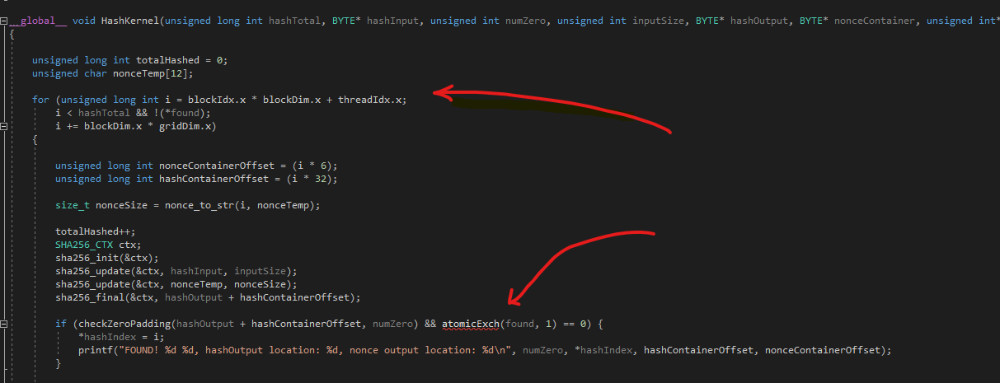

[![LinkedIn][linkedin-shield]][linkedin-url]

<!-- PROJECT LOGO -->
 

  <h3 align="center">CUDA/C++ Compute Server</h3>
  

    Building a super-fast queue-based compute server which natively uses your GPU to perform crypto calculations (SHA-HASH) on demand!
     
  

<!-- ABOUT THE PROJECT -->
## About The Project

I have a passion for writing highly performant applications especially when concurrency is involved, imagine my surprise when I discovered that GPUs offer parallel processing on level that CPUs could not even compare to. This project aims to combine my extensive C++ experience with my new knowledge of GPU programming (CUDA Code).

What are the objectives of this application:
* Using C++ create a socket-server that can accept requests to solve crypto-challenges, and pass it off to the GPU for processing.
* Implement a thread-safe queue system (prevent **race-conditions**) that will use the GPU safely.
* Using 3rd party code, implement SHA-256 hashing algorithm to solve the unique hashing challenge*.

*: The unique hashing challenge is based off the Bitcoin Blockchain, where given an original input, miners are required to find the very first hash with N number of leading 0s. To solve this, miners will take the original input, apply an incremental nonce value, and keep incrementing until a correct solution is found.

To improve this process, I am using an NVIDIA GPU which contains thousands of individual Cuda Cores. This will allow me to hash thousands simultaneously and speed up the process. 

(<a href="#readme-top">back to top</a>)

### Built With

This project was built with the following technologies:

1. Nvidia CUDA: 
  
2. C++ 14: 
  

(<a href="#readme-top">back to top</a>)

<!-- ROADMAP -->
## Features Checklist

- [x] Implement Grid-Stride Algorithm (Distribute Work on GPU)
- [x] Implement C++ HTTP Server
- [x] Implement Unique Challenge in Cuda Code
- [x] Use 3rd party SHA256 Hashing Function with my own Code
- [x] Implement Mutex-Based Queue System
- [x] Implement Utility Functionality to Verify Correct Result

(<a href="#readme-top">back to top</a>)

## Interesting Challenges

From previous project I have learned to work with multiple threads and race-conditions, however, during this project I learned about the Grid-Stride algorithm. This is something unique to GPUs and aims to utilize all hardware processing units called Cuda Cores. 

 

Which I successfully implemented in the CudaSource.su -> function HashKernel().

(<a href="#readme-top">back to top</a>)

<!-- ACKNOWLEDGMENTS -->
## Acknowledgments

I would like to thank another member on Github for providing the Cuda-Code to actually perform the hashing algorithm.
https://github.com/Horkyze/CudaSHA256

Thank you to the Github member that built the HTTP library for C++ (works on both windows and linux). Great so I don't have to write my own Socket Server from scratch!
https://github.com/yhirose/cpp-httplib

Also I would like to thank NVidia for their beginner tutorials that helped me understand how to effectively distribute work on a GPU:
https://developer.nvidia.com/blog/cuda-pro-tip-write-flexible-kernels-grid-stride-loops/

(<a href="#readme-top">back to top</a>)

<!-- MARKDOWN LINKS & IMAGES -->
[linkedin-shield]: https://img.shields.io/badge/-LinkedIn-black.svg?style=for-the-badge&logo=linkedin&colorB=555
[linkedin-url]: https://www.linkedin.com/in/ibrahim-element-7bb674213/
